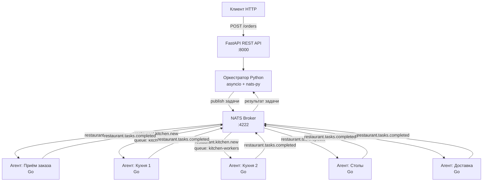

# Архитектура: Обработка заказов в ресторане

**Лабораторная работа №13 · Вариант 10 · Средняя сложность**

## Задание 1 — Описание агентов

| Агент | Топик (подписка) | Вход | Выход | Бизнес-правила |
|-------|-----------------|------|-------|----------------|
| **Приём заказа** | `restaurant.order.new` | `{id, table_id, items[], customer_name}` | `{order_id, table_id, total, valid}` | `table_id > 0`; `items` не пустые; `qty > 0`; `price ≥ 0`; считает итоговую сумму |
| **Кухня** | `restaurant.kitchen.new` | `{order_id, items[]}` | `{order_id, ready, duration_sec}` | Проверяет наличие блюд в меню; `duration_sec ∈ [1..5]` |
| **Столы** | `restaurant.table.update` | `{order_id, table_id, status}` | `{order_id, table_id, status, ok}` | `table_id ∈ [1..20]`; `status ∈ {occupied, free, reserved}`; нельзя занять уже занятый стол |
| **Доставка** | `restaurant.delivery.new` | `{order_id, table_id}` | `{order_id, waiter, done}` | Случайно назначает официанта из пула; `table_id > 0` |

Все агенты публикуют результат в `restaurant.tasks.completed`.

---

## Диаграмма взаимодействия (Mermaid)

---

## Описание компонентов

### Go-агенты (`agent/`)

Один бинарник, тип выбирается флагом `--type`. Каждый агент:
- подписывается на топик через **QueueSubscribe** (балансировка нагрузки)
- десериализует `Task{id, type, payload}`
- вызывает чистую функцию обработки (`processOrder`, `processKitchen`, …)
- публикует `Result{task_id, success, output, error}` в `restaurant.tasks.completed`
- логирует события INFO/ERROR в stdout и опциональный файл
- ведёт счётчик успешно обработанных задач (`Counter`, атомарный)

### Python-оркестратор (`orchestrator/orchestrator.py`)

- Подключается к NATS, подписывается на `restaurant.tasks.completed`
- `send_task(type, payload)` — отправляет задачу и ждёт результат с таймаутом
- При сбое или таймауте повторяет до 3 раз (retry)
- Ведёт счётчик `processed_count`
- Логирует INFO/ERROR через `logging`

### REST API (`orchestrator/api.py`)

FastAPI-обёртка над оркестратором. Эндпоинты:
- `POST /orders` — создать заказ
- `POST /kitchen` — отправить на кухню
- `POST /tables` — обновить статус стола
- `POST /delivery` — запросить доставку
- `GET /stats` — статистика

### Балансировка нагрузки (Задание 7)

Агент кухни запущен в **2 экземплярах**. Оба подписаны с `QueueSubscribe(subject, "kitchen-workers", ...)`. NATS автоматически распределяет сообщения round-robin между членами группы — каждое сообщение получает ровно один агент.

### Обработка ошибок (Задание 6)

- Таймаут: `asyncio.wait_for(future, timeout=30)`
- Retry: до 3 попыток с новым `task_id` при каждой
- Агент возвращает `success=false` при бизнес-ошибке (неверный стол, блюдо не в меню)
